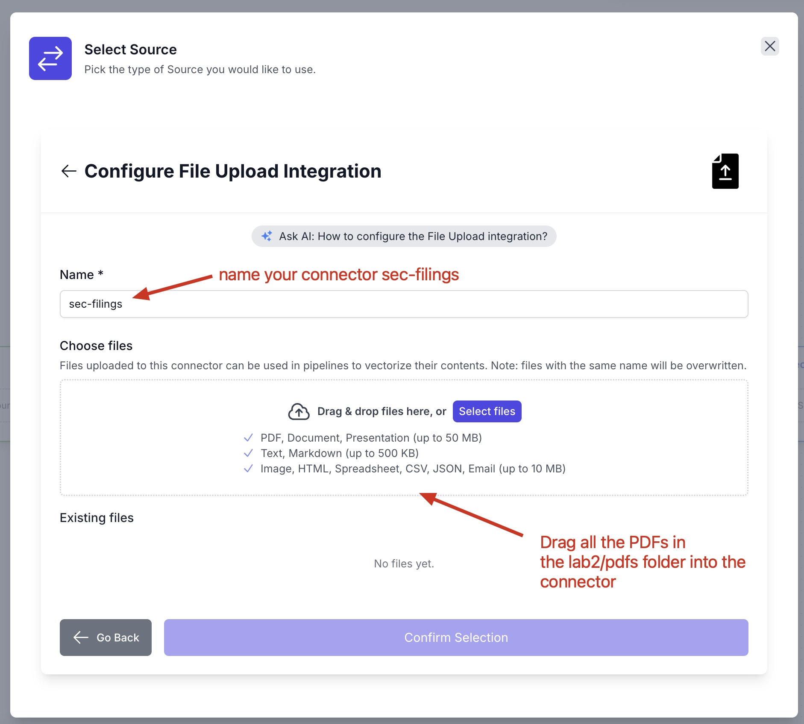

# Lab 2: Building a RAG Pipeline in Vectorize

This lab will guide you through creating a complete RAG (Retrieval-Augmented Generation) pipeline using Vectorize, from setting up data sources to deploying and testing your pipeline.

## Prerequisites

- Access to a Vectorize Pro account
- PDF documents ready for upload (provided in the `pdfs` folder)

## Step 1: Access the Vectorize Dashboard

Navigate to your Vectorize dashboard. You should see your activity summary showing:
- RAG Pipelines count
- Vector Retrievals count  
- Pages Processed count

From the dashboard, you can either manage existing pipelines or build new ones.

## Step 2: Create a New RAG Pipeline

Click on **"Build a New Pipeline"** to start creating a custom pipeline from scratch.

This will take you to the pipeline builder interface where you can configure your RAG pipeline components.

## Step 3: Configure Your Pipeline Name

In the pipeline builder, start by naming your pipeline. For this lab, we'll use "Lab2" as shown in the interface.

The pipeline builder shows a visual workflow with the following components:
- **Source**: Where your data comes from
- **Extractor and Chunker**: How documents are processed
- **Iris Metadata Extraction**: Optional metadata enhancement
- **Embedder**: Converts text to vectors
- **Vector Database**: Stores the embeddings

## Step 4: Select Your Data Source

Click on **"Select Source"** to choose where your documents will come from.

You'll see various source options including:
- Amazon S3
- Azure Blob Storage
- Confluence
- Discord
- DocuSign
- Dropbox
- **File Upload** (recommended for this lab)
- Firecrawl
- GCP Cloud Storage
- GitHub
- Gmail
- Google Drive
- Intercom

Select **"File Upload"** as highlighted in the interface.

## Step 5: Configure File Upload Source

After selecting File Upload, you'll see existing file upload connectors. Click on **"Add a new connector"** at the bottom right.

## Step 6: Name Your File Upload Connector

In the configuration screen, name your connector "sec-filings" as shown.

The interface allows you to:
- Name your connector
- Choose files to upload
- View supported file types (PDF, Document, Presentation up to 50 MB; Text, Markdown up to 500 KB; Image, HTML, Spreadsheet, CSV, JSON, Email up to 10 MB)

## Step 7: Upload Your Documents

Drag and drop all the PDF files from the `pdfs` folder into the upload area. The system will show the uploaded files with their sizes and timestamps.

You should see various NVIDIA 10-K and 10-Q documents uploaded. Once all files are uploaded, click **"Confirm Selection"**.

## Step 8: Configure the Embedder

Back in the pipeline builder, click on **"Select AI Platform"** in the Embedder component.

## Step 9: Choose AI Platform

Select **"Built-in"** as your AI platform, which provides a fully managed, optimized AI platform with no setup required.

The options are:
- **Built-in**: Recommended, fully managed with no setup required
- **Custom Fine-Tuned**: Embedding models fine-tuned on your data, hosted on Vectorize
- **Bring your own AI Platform**: Connect your existing AI platform for full control

## Step 10: Deploy Your Pipeline

With all components configured, click **"Deploy RAG Pipeline"** to create and start your pipeline.

Accept the default values for:
- Extraction Strategy: Fast
- Chunking Strategy: Paragraph
- Chunk Size: 500 tokens
- Chunk Overlap: 50

The pipeline will use:
- Vectorize Built-in embedder with OpenAI v3 Small
- Vectorize Built-in vector database

## Step 11: Monitor Pipeline Status

After deployment, you'll see the pipeline overview showing the "Backfilling" status, indicating the system is processing your uploaded documents.

The pipeline status will show:
- Total Documents: 0 (initially)
- Total Pages: 0 (initially)  
- Total Vectors: 0 (initially)
- RAG Pipeline Status: **Backfilling**

## Step 12: Track Processing Progress

Switch to the **"Initial Load"** tab to monitor the ingestion progress. You'll see the documents being processed with increasing page and vector counts.

The interface shows:
- Overall progress of document ingestion and vectorization
- Event log with timestamps showing processing milestones
- Integration health status for all components

As processing completes, you'll see stats for:
- Total Documents
- Total Pages
- Total Vectors

## Step 13: Test Your RAG Pipeline

Once processing is complete, navigate to the **"RAG Sandbox"** tab to test your pipeline.

In the sandbox, you can:
- Configure system behavior and prompts
- Ask questions about your pipeline data
- View retrieved context chunks
- Test different query approaches

The sandbox provides:
- **System Behavior**: Customize how the AI assistant responds
- **Prompt**: Define the instruction template for queries  
- **Chat Interface**: Interactive testing environment
- **Retrieved Context**: View the relevant chunks retrieved for each query

## Testing Your Pipeline

Try asking questions about the financial data in your uploaded SEC filings, such as:
- "What was NVIDIA's revenue growth in Q3 2024?"
- "What are the main risk factors mentioned by Adobe's management?"

Also, let's try some questions where RAG and Semantic Search will struggle:
- "Compare Adobe's and NVIDIA's R&D spending trends"

We'll see in upcomings labs how context engineering and agentic retrieval can improve the accuracy of our AI. 

## Conclusion

You have successfully built and deployed a RAG pipeline that can:
1. Ingest PDF documents through file upload
2. Extract and chunk text content
3. Generate embeddings using built-in models
4. Store vectors in a managed database
5. Provide semantic search and question-answering capabilities

Your pipeline is now ready to handle queries about the SEC filing data and can be integrated into applications via Vectorize's API.