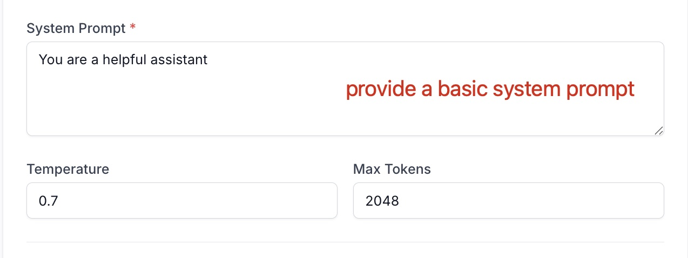
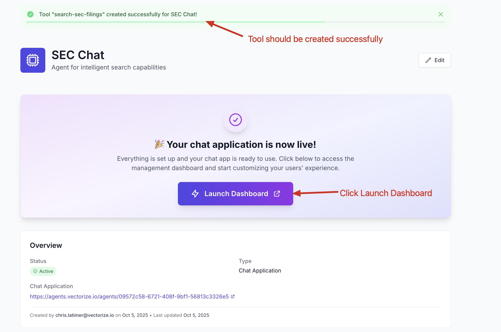

# Lab 3: Creating a Chat Agent with RAG Pipeline Integration

This lab builds on Lab 2 by creating a conversational agent that connects to your RAG pipeline, providing an interactive chat interface for querying your SEC filings data.

## Prerequisites

- Completion of Lab 2 (RAG Pipeline created and deployed)
- Access to a Vectorize Pro account
- Your Lab2 pipeline should be in "Listening" status

## Step 1: Navigate to Agents

From your Vectorize dashboard, click on **"Agents"** in the left sidebar under the AGENTS section.

## Step 2: Access the Agents Interface

You'll see the Agents overview page, which shows existing agents in your workspace. Click the **"New Agent"** button in the top right corner to create a new agent.

The interface shows any existing agents with their names, types, status, tools, and delete options. For new organizations, this area may be empty initially.

## Step 3: Configure Agent Basic Information

In the "Create New Agent" form, configure the following:

- **Agent Name**: Enter "SEC Chat" 
- **Description**: Add a brief description of what the agent will do (optional)
- **Settings**: Keep "Active" checked to enable the agent immediately after creation
- **Agent Type**: Select **"Chat Application"** - this creates a fully managed chat interface like a private ChatGPT

The other options are:
- Model Context Protocol (MCP): For connecting to AI assistants like Claude Desktop
- Chat Widget: For embedding in websites or documentation

## Step 4: Select AI Models

Choose which models users can access in the chat interface. Select both:

- ✅ **OpenAI GPT OSS 120B** - Extremely capable open-source model
- ✅ **Qwen3-32B** - Powerful multilingual, reasoning model

These models will be available for users to choose from in the chat interface.

## Step 5: Configure System Prompt

Set up the basic system behavior:

- **System Prompt**: Enter "You are a helpful assistant" (or customize as desired)
- **Temperature**: 0.7 (controls response creativity)
- **Max Tokens**: 2048 (maximum response length)

## Step 6: Set Authentication

Configure access control for your agent:

- **Authentication Type**: Select **"Secure Access"**
- **Admin Username**: Enter "admin"
- **Admin Password**: Create a strong password
- **Confirm Password**: Re-enter the same password

The password requirements are:
- ✅ At least 8 characters
- ✅ Contains a letter
- ✅ Contains a number
- ✅ Contains a special character
- ✅ Passwords match

Click **"Create Agent"** when all fields are completed.

## Step 7: Agent Creation Success

Your agent will be created and you'll see the overview page:

The agent is now active with:
- **Status**: Active
- **Type**: Chat Application
- **Chat Application URL**: A unique URL for accessing your chat interface

Note the message: "You're almost there! Add one or more tools to connect your chat application with your RAG pipeline data and your setup will be complete."

## Step 8: Create New Tool

Click **"Create New Tool"** to connect your agent to the Lab2 pipeline.

## Step 9: Configure the Search Tool

Fill out the tool configuration:

- **Pipeline**: Select "Lab2" from the dropdown
- **Tool Name**: Enter "search-sec-filings"
- **Description**: "Search for information from the SEC filings knowledge base"

The tool automatically includes standard parameters:
- **question**: The search query used to find relevant documents
- **k**: Number of documents to retrieve (default: 10)
- **rerank**: Optional reranking for improved relevance
- **mode**: Search mode options (vector, hybrid, text)

## Step 10: Review Parameters and Create Tool

Review the parameter settings:

The standard parameters are:
- **question** (Required): Search query for the vector index
- **k** (Required): Number of documents to retrieve (set to 10)
- **rerank** (Optional): Enable reranking for improved relevance
- **mode** (Optional): Search mode - vector (default), hybrid, or text

No custom dynamic parameters or hard-coded filters are needed for this basic setup.

Click **"Create Tool"** to finalize the configuration.

## Step 11: Tool Creation Success

You'll see a success message confirming the tool was created:

The message indicates: "Tool 'search-sec-filings' created successfully for SEC Chat!"

Your chat application is now live and ready to use. Click **"Launch Dashboard"** to access the chat interface.

## Step 12: Access the Chat Interface

The launch dashboard opens your chat application's login page:

Enter the credentials you configured during agent creation:
- **Email or Username**: admin
- **Password**: [the password you set]

Click **"Sign In"** to access the chat.

## Step 13: Start Chatting

Once logged in, you'll see the chat interface:

The interface includes:
- **Welcome message**: "Welcome to SEC Chat - How can I help you today?"
- **Suggested prompts** for getting started
- **Chat input box**: "Ask anything"
- **Model selector**: Shows "OpenAI GPT OSS 120B" (switchable)
- **Powered by Vectorize** branding

## Testing Your Agent

Try asking questions about your SEC filings data, such as:

- "What information is available in the knowledge base?"
- "What are the most important things I should know?"
- "Can you summarize the key points about NVIDIA's revenue growth?"
- "Help me understand how Adobe's R&D spending has changed over time?"

The agent will use your Lab2 pipeline to search through the SEC filings and provide informed responses based on the retrieved documents.

## Conclusion

You have successfully created and deployed a conversational agent that:

1. **Connects to your RAG pipeline** from Lab 2
2. **Provides secure access** with username/password authentication
3. **Offers multiple AI models** for varied response capabilities
4. **Includes semantic search functionality** through the custom tool
5. **Delivers a ChatGPT-like experience** for your private SEC filings data

Your agent is now accessible via a web interface and can be shared with team members or stakeholders who need to query your financial document knowledge base. The secure authentication ensures only authorized users can access the sensitive financial data.

## Next Steps

Consider customizing your agent further by:
- Refining the system prompt for more specific financial analysis behavior
- Adding additional tools for different types of searches or analysis
- Adjusting search parameters based on usage patterns
- Creating additional agents for different user groups or use cases