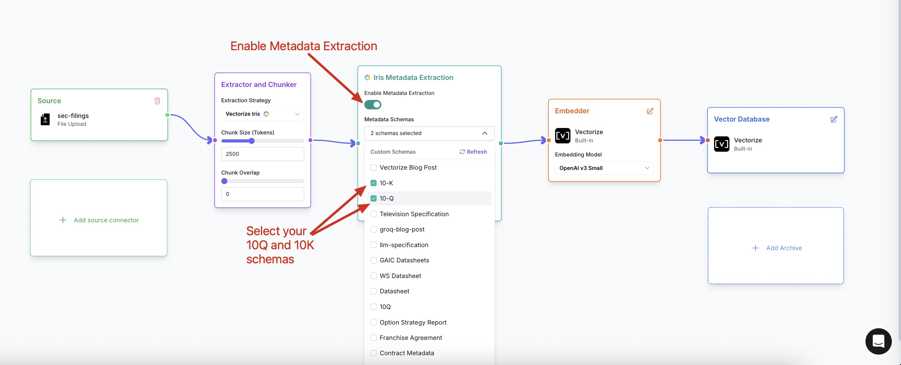

# Lab 4: Building an Enhanced RAG Pipeline with Metadata Extraction

## Overview
In this lab, you'll enhance the RAG (Retrieval-Augmented Generation) pipeline created in Lab 2 by adding metadata extraction capabilities. This will enable more sophisticated search and filtering capabilities in your SEC filings chatbot.

## Prerequisites
- Completed Lab 2 (SEC filings data source setup)
- Completed Lab 3 (SEC Chat Agent creation)
- Access to Vectorize platform

## Lab Objectives
By the end of this lab, you will:
1. Create metadata schemas for 10K and 10Q documents
2. Configure a new RAG pipeline with metadata extraction
3. Update your SEC Chat agent to use the enhanced pipeline
4. Test the improved search capabilities with metadata filtering

## Step-by-Step Instructions

### Part 1: Create Metadata Schemas

#### Step 1: Navigate to Metadata Schemas
1. Log into your Vectorize workspace
2. In the left sidebar under **PIPELINES**, click on **Metadata Schemas**


#### Step 2: Create 10K Schema
1. Click the **New Schema** button


2. Choose **Start Blank** option


3. Name your schema: `10K`
4. Switch to **JSON Mode**


5. Copy and paste the contents from `lab4/schemas/10k.json` into the editor


6. Save the schema

#### Step 3: Create 10Q Schema
1. Create another new schema
2. Name it: `10Q`


3. Switch to JSON Mode
4. Copy and paste the contents from `lab4/schemas/10q.json`
5. Save the schema

### Part 2: Build the Enhanced RAG Pipeline

#### Step 1: Create New Pipeline
1. Navigate to **New RAG Pipeline** in the sidebar


2. Name your pipeline: `Lab 4`


#### Step 2: Configure Source
1. In the Source node, click **Select Source**
2. Choose **File Upload**


3. Select the existing **sec-filings** source from Lab 2


#### Step 3: Configure the Pipeline Nodes
The pipeline view shows all connected nodes. You can see the Source is now connected with sec-filings.


#### Step 4: Select AI Platform for Embedder
1. Click on the **Embedder** node
2. Click **Select AI Platform**
3. Choose **Built-in** (Recommended) - this provides a fully managed, optimized AI platform with no setup required


#### Step 5: Configure Extraction Strategy
1. In the **Extractor and Chunker** node, set:
   - **Extraction Strategy**: `Vectorize Iris`
   - **Chunk Size (Tokens)**: `2500`
   - **Chunk Overlap**: `0`


#### Step 6: Enable and Configure Metadata Extraction
1. Click on the **Iris Metadata Extraction** node (the node between Extractor and Embedder)
2. Toggle **Enable Metadata Extraction** to ON (green)
3. Under **Metadata Schemas**, click the dropdown and select:
   - `10-K`
   - `10-Q`

The selected schemas will show "2 schemas selected" when both are chosen.



#### Step 7: Configure Vector Database
1. Keep the default **Vectorize Built-in** database
2. Click **Deploy RAG Pipeline** button


#### Step 8: Wait for Processing
The pipeline will begin processing your documents. You'll see:
- Total Documents
- Total Pages
- Total Vectors
- You totals will be different than what is displayed.
- When the pipeline status switches to "Listening" your pipeline has processed the documents.


This process will take several minutes. The pipeline will change to **Listening** when it's done processing, then **Idle** when it's shut down.


### Part 3: Update the SEC Chat Agent

#### Step 1: Navigate to Agents
1. Click on **Agents** in the sidebar
2. Find and click on **SEC Chat** agent from Lab 3


#### Step 2: Edit Agent Tool Configuration
1. Click on the **Edit** button for the `search-sec-filings` tool


2. In the Pipeline dropdown, change from Lab 2 to **Lab 4**


#### Step 3: Add Dynamic Parameters
1. Scroll down to the **Dynamic Parameters** section
2. Click **Bulk Add Fields**


3. Select the following metadata fields:
   - `ticker`
   - `fiscal_year`
   - `fiscal_quarter`
   - `document_type`
4. Click **Import 4 Fields**


5. You'll see the parameters added with their descriptions
6. Click **Update Tool** to save changes


### Part 4: Test the Enhanced Agent

#### Step 1: Launch the Chat Application
1. Click **Launch Dashboard** to open the chat interface


#### Step 2: Test Queries with Metadata
Try these example queries that leverage the metadata extraction:

**Example Query:**
```
How did Adobe's revenue change from Q3 2024 to Q1 2025?
```

**Expected Behavior:**
- The agent will search for Adobe's Q3 2024 10-Q filing
- Filter by `ticker: ADBE`, `document_type: 10-Q`, `fiscal_year: 2024`, `fiscal_quarter: Q3`
- Then search for Q1 2025 filing with updated parameters
- Provide a revenue comparison with specific numbers

#### Step 3: Enable Tool Output Visibility
1. Toggle **Show tool output** to see the actual tool calls
2. Expand the debug view to inspect:
   - The exact parameters being passed
   - The metadata filters being applied
   - The documents being retrieved


### Verification Checklist

 **Metadata Schemas Created:**
- [ ] 10K schema successfully created
- [ ] 10Q schema successfully created

 **RAG Pipeline Configuration:**
- [ ] Pipeline named "Lab 4" created
- [ ] Metadata extraction enabled
- [ ] Both schemas selected
- [ ] Chunk size set to 2500
- [ ] Pipeline successfully deployed and processed all documents

 **Agent Tool Updated:**
- [ ] Agent tool updated to use Lab 4 pipeline
- [ ] Dynamic parameters added (ticker, fiscal_year, fiscal_quarter, document_type)
- [ ] Tool successfully updated

 **Testing:**
- [ ] Chat application launches successfully
- [ ] Queries with specific companies and quarters work
- [ ] Tool output shows correct metadata filtering
- [ ] Results are more accurate than Lab 3

## Key Improvements Over Lab 3

1. **Structured Metadata:** Documents now have structured metadata fields that can be used for filtering
2. **Precise Retrieval:** Queries can target specific fiscal periods and document types
3. **Better Accuracy:** The agent can distinguish between different quarters and years
4. **Debugging Capability:** Tool output visibility helps understand how the agent is searching

## Troubleshooting

**Pipeline stuck in "Listening" state:**
- This is normal during initial processing
- Processing 1,676 pages typically takes 5-10 minutes
- Check the progress bar for completion status

**Metadata fields not appearing:**
- Ensure metadata extraction was enabled before deployment
- Verify both schemas were selected
- Check that the pipeline status is "Idle" (processing complete)

**Agent not using metadata filters:**
- Verify the dynamic parameters were successfully imported
- Check that the tool was updated after adding parameters
- Try being more specific in your queries (mention company ticker, quarter, year)

## Next Steps
- Experiment with additional metadata schemas for other document types
- Try creating hard-coded filters for specific use cases
- Explore adding more dynamic parameters for advanced filtering
- Consider implementing custom metadata extraction patterns

## Conclusion
You've successfully enhanced your RAG pipeline with metadata extraction, enabling more sophisticated and accurate document retrieval. The combination of semantic search with metadata filtering provides a powerful foundation for building production-ready AI applications.